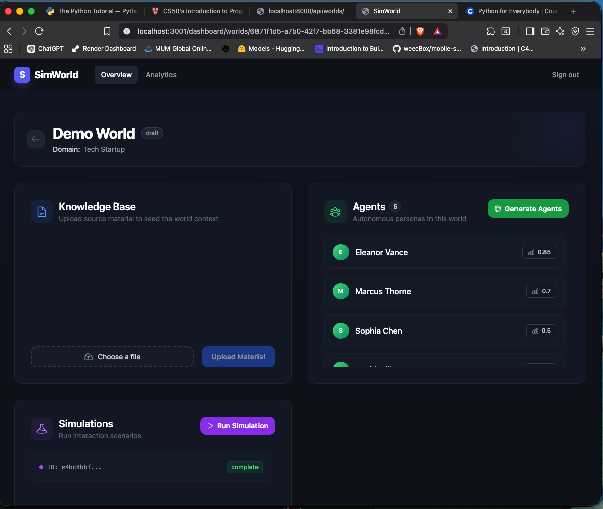
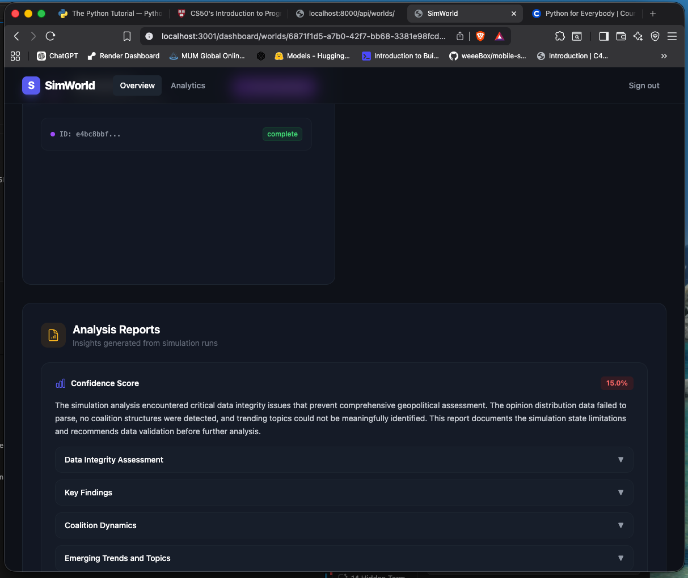
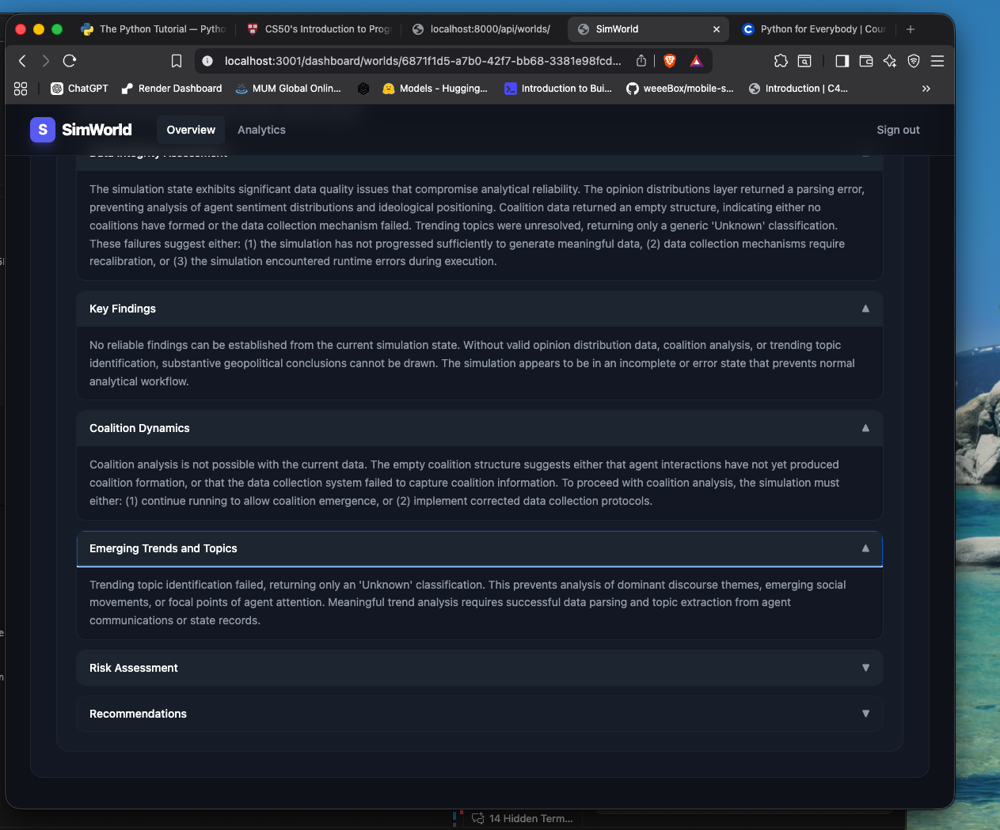

# 🌟 Welcome to SimWorld! 🌟

Imagine you have the biggest, most magical toy box in the universe. But instead of normal plastic action figures, this toy box is filled with **smart little robot people**! 🤖✨

SimWorld is a super fun game where you get to be the boss of a whole new world inside your computer. You make the rules, you pick the story, and then you watch your little robots come to life, talk to each other, and make big decisions!

---

## 🎮 How Do You Play?

Here is the step-by-step adventure of building your world:

### 1. 🌍 Pick Your Playground (Make a World)

First, you decide where your robots will live!

- Do they live in a shiny space station floating near the stars? 🚀
- Are they pirates sailing on a big blue ocean? 🏴‍☠️
- Or are they the mayor of a busy, bustling city? 🏙️
  You get to name your world and decide what kind of place it is!

### 2. 📖 Read Them a Story (Upload the Seed)

Robots need to know the rules of their world! You can give the computer a story, a book, or a secret mission paper. The computer reads it super, super fast!

- It figures out who the heroes are.
- It finds out where the secret treasure is hidden.
- It learns all the rules of your playground.

### 3. 🤖 Make Your Robot Friends (Generate Agents)

Now comes the best part! The computer uses the story to magically build your robot people (we call them "Agents").
Every robot is different!

- Some robots are super brave and love to explore. 🦁
- Some are a little grumpy and like to argue. 😠
- Some are super friendly and just want to make friends. 😊
  They all get their very own names, their own memories, and things they care about!

### 4. 🎬 Press PLAY! (Run the Simulation)

When you are ready, you press the big "PLAY" button!
The robots wake up and start playing the game by themselves. They will talk to each other, share their secrets, argue about what to do next, and team up into groups. It's like watching a cartoon that makes itself up as it goes!

### 5. 📝 Read the Morning News (The Report)

When the game is over, the computer writes a newspaper just for you! It tells you:

- What the robots decided to do.
- Who became best friends and who got mad at each other.
- What they think will happen next in the story!

---

## 🛠️ How Do We Build the Magic? (For the big kids)

It takes a lot of powerful, invisible helpers to make this toy box work:

- 🐘 **A Giant Elephant (PostgreSQL):** Elephants never forget! This helper remembers all the robots' names, the worlds you built, and the stories they told.
- 🔴 **A Fast Messenger (Redis & Celery):** When the robots have a lot to think about, this helper runs super fast to organize their thoughts so they don't bump into each other.
- 🕸️ **A Big Spider Web (Neo4j):** This draws invisible glowing strings between the robots. It remembers who is friends with who, and who is the boss!
- 🧠 **A Super Brain (LLM/AI):** This is the magic thinking cap! It gives the robots their feelings, helps them talk in full sentences, and helps them come up with new ideas.
- 🖥️ **A Shiny Screen (Next.js & React):** This is the window you look through to click buttons, see your worlds, and read the news!

---

## 🚀 Ready to Turn it On?

If you want to turn on the magic toy box, ask an adult to look at the `RUN_INSTRUCTIONS.md` file. It has all the secret computer codes to start the engine and wake up the robots!

Have fun building your universe! 🌌

---

## 📸 Screenshots

### World Overview

### Analysis Report

